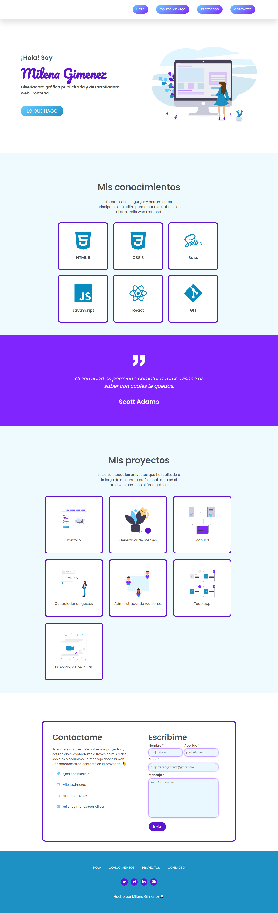

# Portafolio de ADA

### Este proyecto es el trabajo final del modulo-01, en el cursado de Desarrollo Web Frontend de ADA. El mismo trata de un portafolio personal para presentar los trabajos realizados a lo largo del cursado.

<br>

### 🔍 Podes visualizar el proyecto haciendo click en este [enlace](https://milenagimenez.github.io/Proyecto-portafolio/) o en [este](https://confident-sinoussi-50f6b4.netlify.app/)

***
### 💻 Si deseas tener el código en tu computadora, podes realizar los siguientes pasos a continuación:

<br>


- Ir al [repositorio](https://github.com/milenagimenez/Proyecto-portafolio) 

- Hacer click al botón Fork

- Clickar el botón Code

- Copiar la URL

- Abrir la terminal y poner el comando de ```git clone <url>```
- Entrar a la carpeta del proyecto y abrirlo en tu IDE

<br>

### 📎 Este proyecto no necesita la intalación de ninguna dependencia, por ahora!

<br>

***

### 🚀 Este debería ser el resultado final de tu instalación! 

<br>



<br>

***
## 😊 Agradecimientos 

- A nuestro profesor [Jonh](https://github.com/Jonhks), por la paciencia y claridad al enseñar y por su gran vocación como docente

- A [Leydy](https://github.com/leydyk93), por siempre estar dando una gran mano en todos los problemas que se nos presenten

- Y a todas mis compañeras por estar siempre presentes ayudando y apoyando! 

***

*Hecho por Milena Gimenez* 🌼
